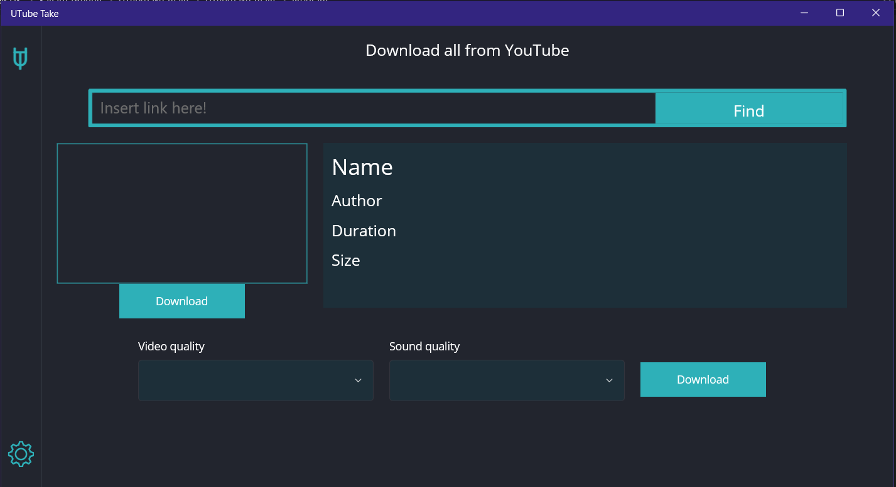
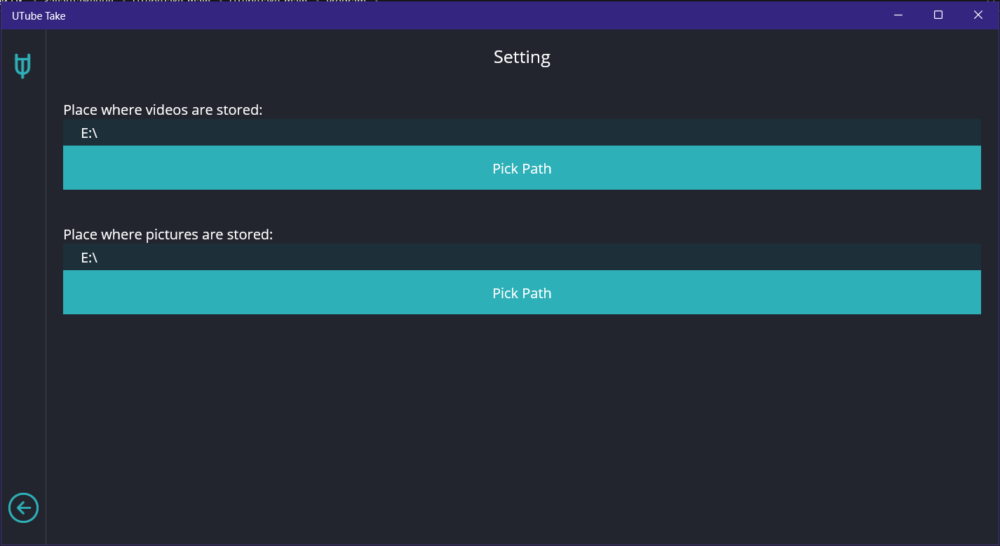
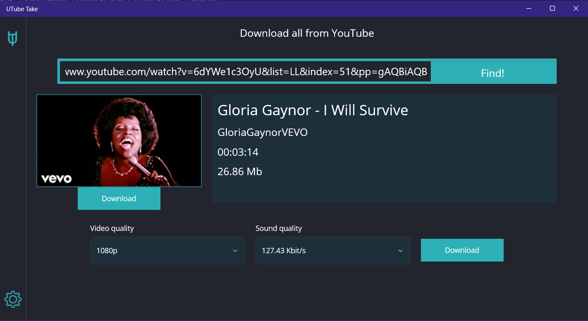

<h1 align="center">
UTubeTake
</h1>

<h1 align="center">
   
   
   
</h1>

    <b align ="center">Program for download video and image from YT, with with any quality</b>

## Table of Contents
1. [Introduction](#Introduction)
2. [Preview of work](#Preview-of-work)
3. [How to install](#How-to-install)
4. [How to use](#How-to-use)
5. [Tip for use](#Tip)

## <a name="Introduction">Introduction</a>
A small program that allows you to download various files from YouTube. This list includes: Video (in any quality), Audio (in any quality) and Preview videos. And of course, you can download either only the video or only the audio track. In a convenient and fast interface.  

## <a name="Preview-of-work">Preview of work</a>

 Images

  

    

    

 
    

    

## <a name="How-to-install">How to install</a>
* Download and open project in VS
* Download in project next NuGet package: **[YoutubeExplode](https://github.com/Tyrrrz/YoutubeExplode)**
* Download in project next NuGet package: **[YoutubeExplode.Converter](https://github.com/Tyrrrz/YoutubeExplode/tree/master/YoutubeExplode.Converter)**
* Open the "Program.zip" and find the "ffmpeg-windows-x64" folder there, copy it. And paste it into the place where you will build the project.
* Use project!
  
## <a name="How-to-use">How to use</a>
* 0 - Download project
* 1 - Take "Program.zip" and unpack them wherever it is convenient.
* 2 - Open folder
* 3 - Find "UTubeTake.exe" create shorcut
* 4 - Instead of a shortcut, place it where it will be convenient for you to use it
* 5 - Open shortcut or "UTubeTake.exe"
* 6 - Go to settings and select the location of the saved files.
* 7 - Set link and download files.

## <a name="Tip">Tip for use</a>
* Select all - .mp4 
* No video - without video(.mp3)
* No audio - without audio(.mp4)
