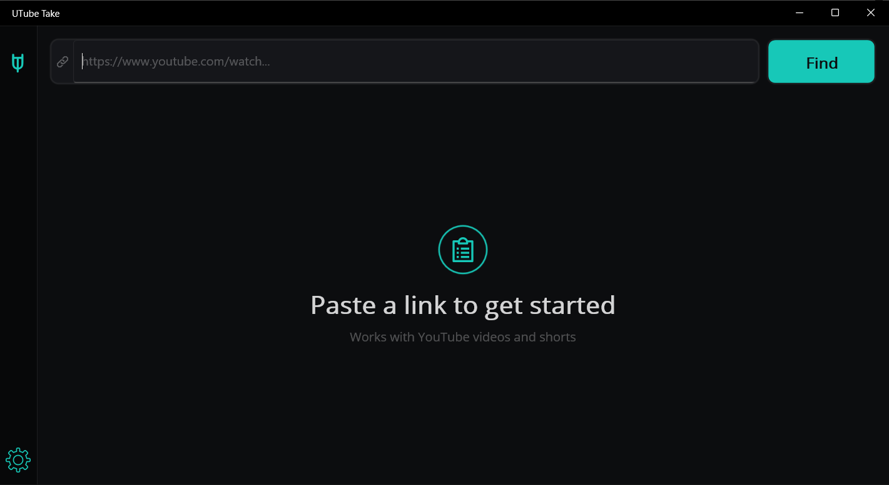
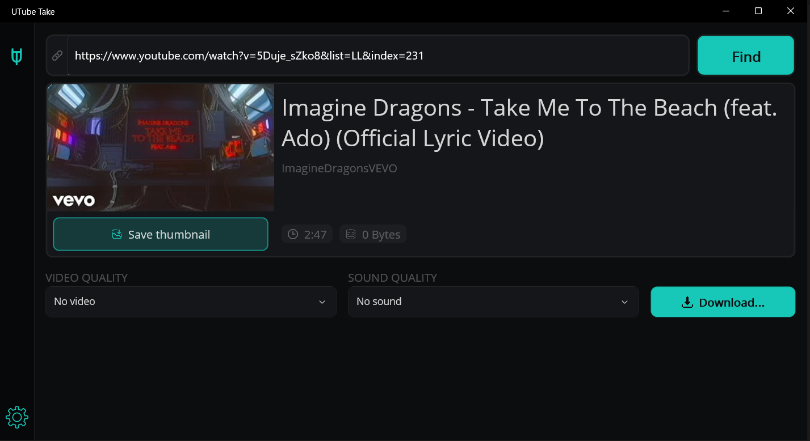
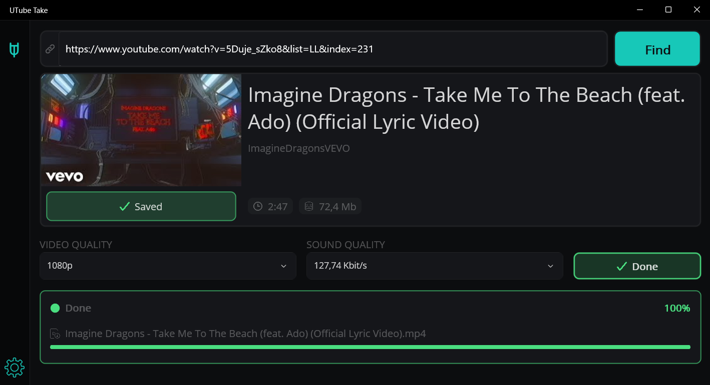
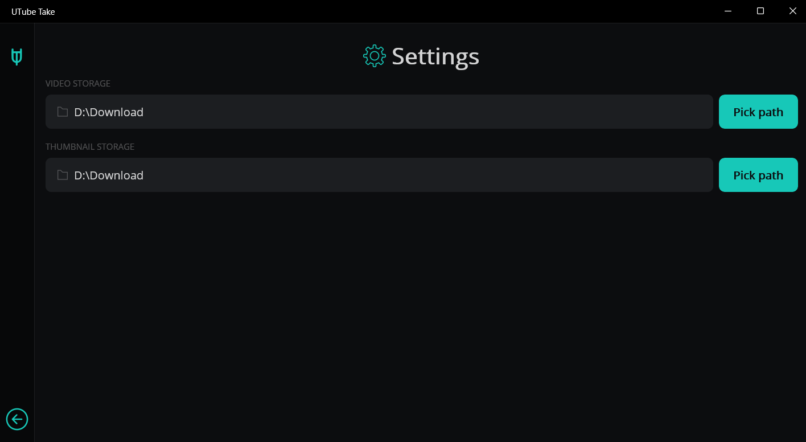
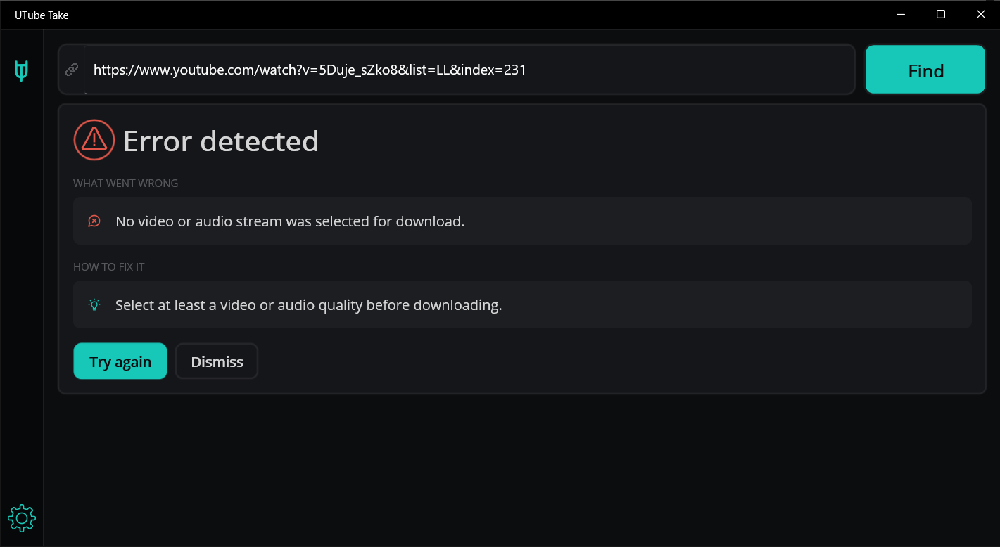

<h1 align="center">
UTubeTake
</h1>
<h1 align="center">
   
   
   
</h1>

    <b align="center">Download video, audio, and thumbnails from YouTube — in any quality, mixed and matched to your needs</b>

  

## Table of Contents
1. [Introduction](#Introduction)
2. [Download](#Download)
3. [Preview of work](#Preview-of-work)
4. [How to install](#How-to-install)
5. [How to use](#How-to-use)
6. [Tip for use](#Tip)

## <a name="Introduction">Introduction</a>
A small program that lets you download video, audio, and thumbnails from YouTube. Pick any video quality, any audio quality, and combine them however you need — video only, audio only, or both together, in a fast and simple interface.

**Features**
* Download video in any available quality
* Download audio in any available quality
* Mix and match video/audio quality, or download just one of them
* Save video thumbnails separately
* Set custom save locations for videos and thumbnails
* Clear, built-in error messages when something goes wrong

## <a name="Download">Download</a>
No need to build anything — just grab the latest build:

1. Go to the [**Releases**](https://github.com/MrUnowNSoG/UTubeTake/releases) page
2. Download the latest version
3. Unpack the archive and run `UTubeTake.exe`

## <a name="Preview-of-work">Preview of work</a>

 Images

  

    

<i>Paste a YouTube link to get started</i>

    

<i>Pick video/audio quality or save the thumbnail</i>

    

<i>Download finished</i>

    

<i>Choose where videos and thumbnails are saved</i>

    

<i>Clear explanations when something goes wrong</i>

## <a name="How-to-install">How to install</a>
**Build from source**
* Download and open the project in Visual Studio
* Restore the following NuGet packages:
  * **[YoutubeExplode](https://github.com/Tyrrrz/YoutubeExplode)**
  * **[YoutubeExplode.Converter](https://github.com/Tyrrrz/YoutubeExplode/tree/master/YoutubeExplode.Converter)**
* Download the latest version in the [**Releases**](https://github.com/MrUnowNSoG/UTubeTake/releases) page
* Open `Program.zip`, find the `ffmpeg-windows-x64` folder inside, and copy it in to your build output
* Build and run the project

## <a name="How-to-use">How to use</a>
1. Paste a YouTube video or shorts link into the field at the top
2. Click **Find**
3. Choose a video quality, an audio quality, or both
4. (Optional) Click **Save thumbnail** to download the video's thumbnail
5. Click **Download...**
6. Wait for the progress bar to reach 100% — your file is ready

You can set default save folders for videos and thumbnails in **Settings** (gear icon, bottom left).

## <a name="Tip">Tip for use</a>
* Video + audio selected — saved as `.mp4` with sound
* Audio only ("No video") — saved as `.mp3`
* Video only ("No audio") — saved as `.mp4` without sound